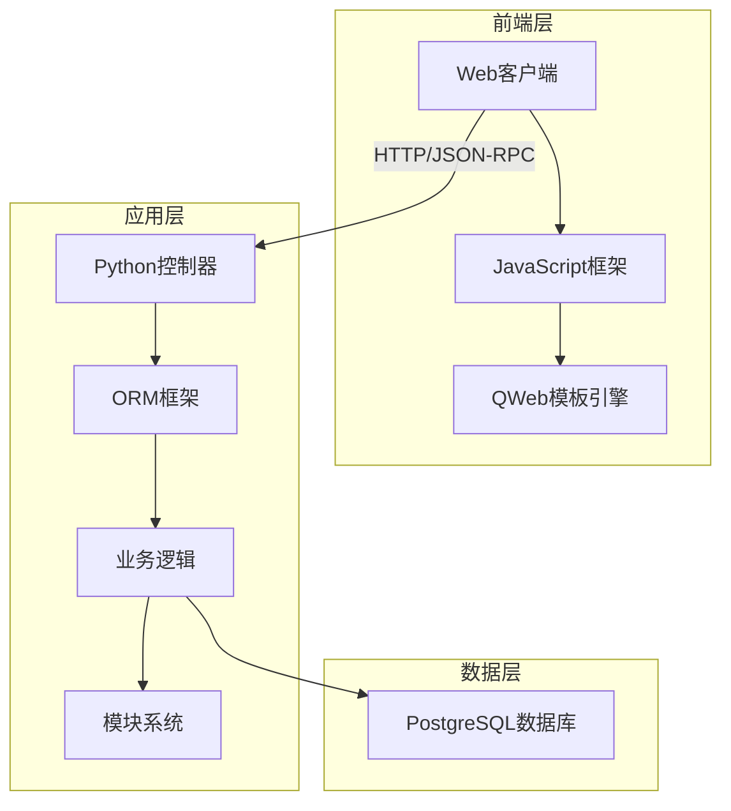
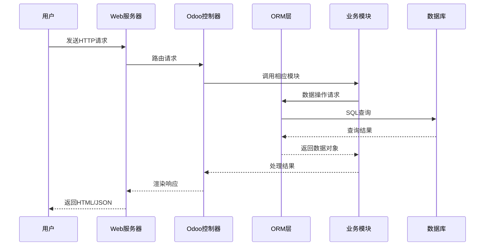
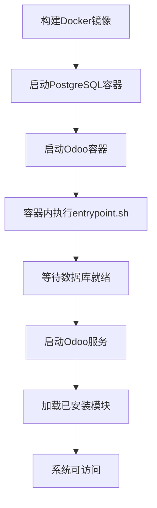
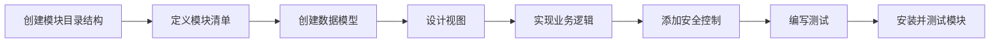

# Odoo项目结构与架构说明

## 项目概述

Odoo是一套基于网络的开源商业应用程序套件，提供ERP（企业资源计划）、CRM（客户关系管理）、电子商务、仓库管理、项目管理、会计、人力资源等多种业务功能。本文档描述了Odoo项目的结构、运行流程、目录体系以及架构设计，旨在帮助开发者理解系统以便进行二次开发。

## 系统架构

Odoo采用典型的三层架构设计：



### 架构特点

1. **模块化设计**：Odoo的所有功能都基于可插拔的模块系统，每个模块可独立安装、卸载和更新
2. **MVC模式**：采用Model-View-Controller架构模式
3. **ORM框架**：强大的对象关系映射层，简化数据库操作
4. **插件机制**：支持通过继承和扩展现有功能进行二次开发
5. **多租户支持**：单一实例可支持多个独立数据库（多公司）

## 运行流程

Odoo的运行流程如下所示：



### Docker环境启动流程

基于Docker的开发环境启动流程如下：



1. 构建Docker镜像：`docker build -t the-one-erp:1.0 .`
2. 启动服务：`docker compose up -d`
3. 服务初始化并启动Odoo和PostgreSQL
4. entrypoint.sh脚本处理环境变量和数据库连接
5. 系统初始化后可通过http://localhost:8069访问

## 目录结构说明

### 根目录结构

```
/
├── odoo/                  # Odoo核心源代码
├── addons/                # Odoo标准业务模块
├── dockerrun/             # Docker环境配置
│   ├── config/            # Odoo配置文件
│   ├── extra-addons/      # 自定义模块目录
│   └── docker-compose.yml # Docker编排配置
├── setup/                 # 安装相关脚本和工具
├── Dockerfile             # Docker镜像构建定义
├── requirements.txt       # Python依赖列表
├── odoo.conf              # Odoo默认配置文件
├── entrypoint.sh          # Docker容器入口脚本
└── odoo-bin               # Odoo启动脚本
```

### Odoo核心目录结构

```
/odoo/
├── addons/         # Odoo基础模块
├── api.py          # API定义和装饰器
├── cli/            # 命令行工具
├── conf/           # 配置管理
├── fields.py       # 字段类型定义
├── http.py         # HTTP控制器
├── models.py       # ORM模型定义
├── modules/        # 模块加载机制
├── service/        # 服务管理
├── tools/          # 通用工具函数
└── tests/          # 测试框架
```

### 模块目录结构

每个Odoo模块（标准模块或自定义模块）通常具有以下结构：

```
module_name/
├── __init__.py       # Python初始化文件
├── __manifest__.py   # 模块清单和元数据
├── controllers/      # HTTP控制器
├── models/           # 业务模型定义
├── views/            # XML视图定义
├── security/         # 权限和访问控制
├── data/             # 初始数据
├── demo/             # 演示数据
├── static/           # 静态资源(JS,CSS,图片等)
├── wizards/          # 向导
└── report/           # 报表模板
```

## 开发与定制

### 模块开发流程



### 二次开发方法

1. **继承扩展**：通过继承现有模型和视图进行功能扩展
2. **模块开发**：开发全新的功能模块
3. **视图定制**：修改或创建新的界面视图
4. **报表开发**：定制业务报表
5. **工作流定制**：修改业务流程和审批流程

## 技术栈

- **后端**：Python, PostgreSQL
- **ORM框架**：自研ORM系统
- **Web框架**：Werkzeug
- **前端**：JavaScript, jQuery, Bootstrap, QWeb
- **报表引擎**：QWeb, Wkhtmltopdf
- **部署**：Docker, uWSGI/Gunicorn

## 常见应用场景

1. **销售管理**：销售订单、报价单、销售分析
2. **采购管理**：采购订单、供应商管理
3. **库存管理**：库存移动、盘点、批次追踪
4. **制造管理**：生产订单、BOM、工作中心
5. **财务管理**：会计科目、账单、付款
6. **人力资源**：员工管理、招聘、考勤
7. **项目管理**：任务、时间跟踪、项目报告
8. **网站与电子商务**：在线商店、产品展示 