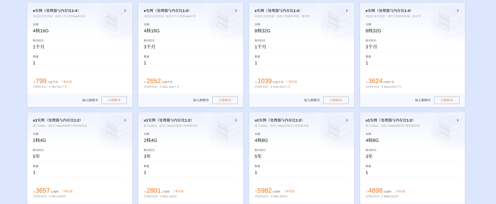

# 恒算科技ERP系统 - 超值定价方案

## 🌟 产品核心优势

### 技术实力
- 国内软件行业TOP级开发团队
- 系统稳定性强，性能卓越
- 操作界面美观，用户体验极佳

### 功能亮点
- 移动办公：在家通过手机或电脑随时随地查看生产状态和库存
- 智能管理：支持手机扫码，无需额外设备
- 全流程覆盖：采购、生产、销售、库存一体化
- 人力资源：员工管理、工资管理、合同管理
- 财务模块：完整的会计系统
- 无限并发：不限制同时在线人数

## 🎁 超值模块赠送

### 基础模块（全部包含）
- 销售管理
- 财务管理
- 采购管理
- 库存管理
- 生产制造
- 人力资源管理
- 智能条码系统

### 赠送模块（50+个）
- 客户关系管理(CRM)
- 项目管理
- 资产管理
- 质量管理
- 设备管理
- 更多模块持续更新中...

## 💰 超值定价方案

### 基础方案
- 软件买断价：¥188,800（原价）
- 包含所有基础模块和赠送模块
- 软件终身使用授权

### 年度服务费
- 云服务器费用：¥9,800/年
- 技术支持维护：¥4,000/年
- 合计：¥13,800/年

## 🎉 限时优惠活动（2024年4-5月）

### 签约优惠
1. 买断价直降：¥128,800（立省¥60,000）
2. 首年服务费6折（价值¥8,280）
3. 免费提供系统培训（价值¥5,000）

### 老客户推荐奖励
- 成功推荐新客户签约，反现奖励1.5%现金

## 📱 智能条码系统优势

- 无需购买扫码枪，手机即可扫码
- 支持生产流水线实时扫码
- 库存管理一键扫码出入库
- 数据实时同步，操作简单便捷
- 大幅提升工作效率，降低人力成本

## 🤝 服务承诺

- 技术支持
- 免费系统升级
- 定期功能更新
- 专业培训支持
- 数据安全保障

---

*注：本方案最终解释权归恒算科技所有* 

## 附录
- 云服务器大致价格
