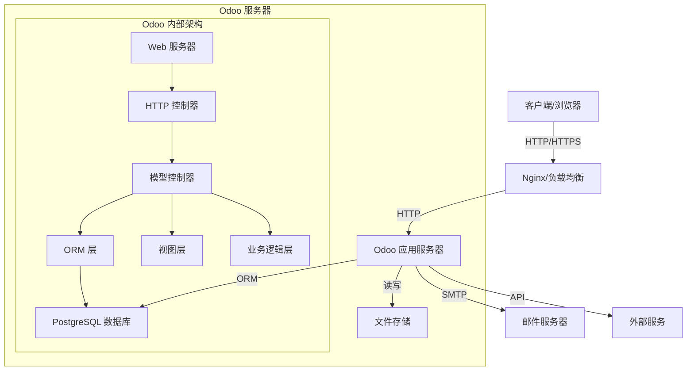
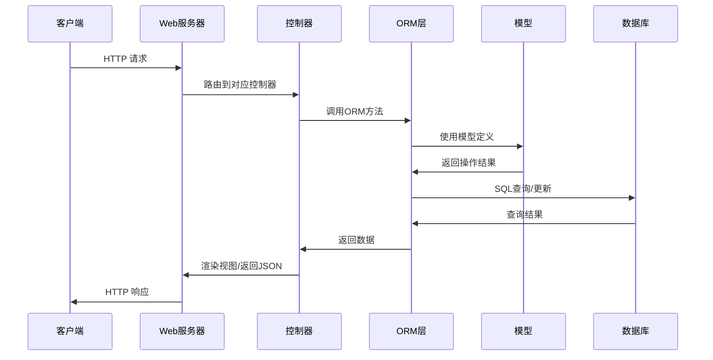
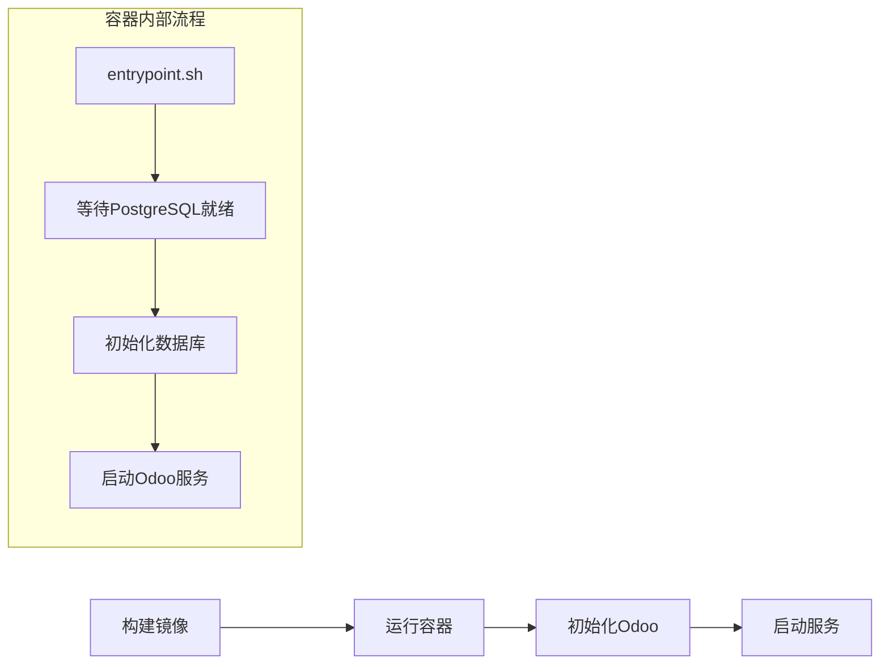
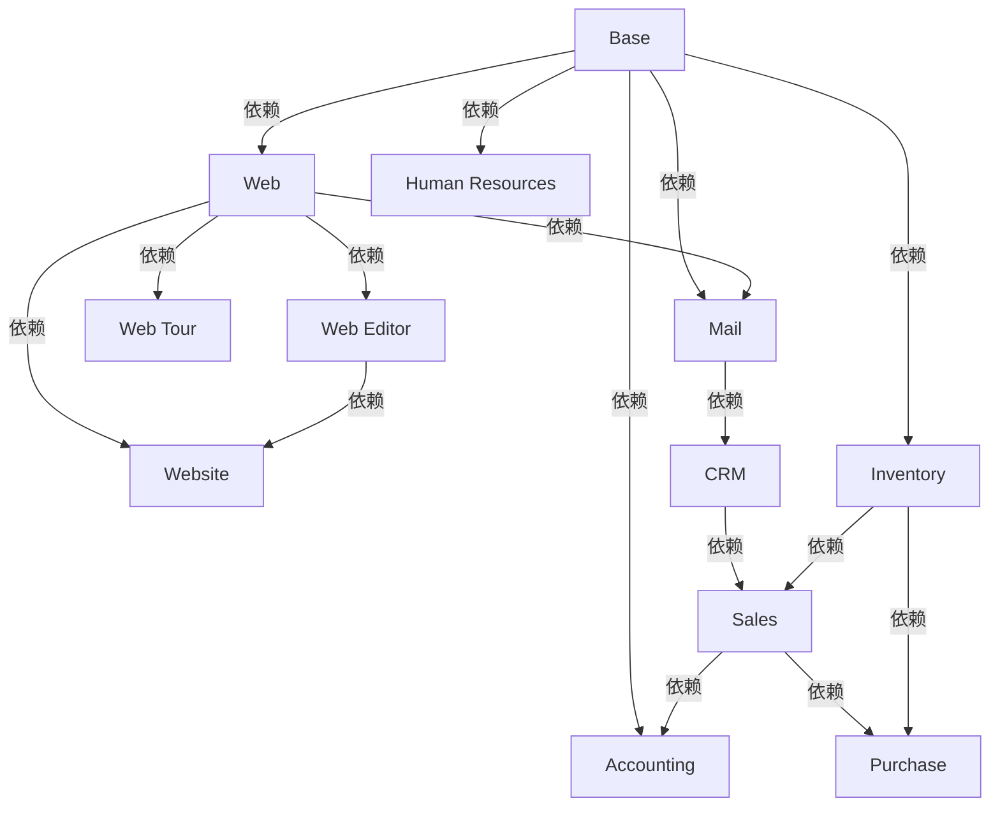

# Odoo v18 项目架构说明

本文档描述了基于 Odoo v18 的项目架构、运行流程、核心模块及其依赖关系。该项目是在 Odoo 开源框架基础上进行二次开发，添加了 Docker 配置以方便本地开发和部署。

## 1. 项目结构

```
odoo-project/
├── addons/                 # 扩展模块目录
├── odoo/                   # Odoo 核心代码
│   ├── addons/             # 内置基础模块
│   ├── api.py              # API 定义
│   ├── cli/                # 命令行工具
│   ├── conf/               # 配置相关
│   ├── fields.py           # 字段定义
│   ├── http.py             # HTTP 控制器
│   ├── models.py           # ORM 模型定义
│   ├── modules/            # 模块加载和管理
│   ├── service/            # 服务定义
│   ├── sql_db.py           # 数据库连接管理
│   └── tools/              # 工具函数
├── Dockerfile              # Docker 镜像构建定义
├── odoo.conf               # Odoo 配置文件 
├── entrypoint.sh           # Docker 入口脚本
├── requirements.txt        # Python 依赖列表
├── wait-for-psql.py        # PostgreSQL 连接等待脚本
└── setup.py                # Python 包安装脚本
```

## 2. 系统架构图



## 3. 运行流程原理图



## 4. Docker 部署流程



## 5. 核心模块说明

Odoo 采用模块化架构，以下是一些核心模块及其功能：

| 模块名称 | 描述 | 依赖模块 |
|---------|------|---------|
| base | 基础模块，提供基本数据结构和功能 | 无 |
| web | Web客户端核心模块 | base |
| web_editor | 网页编辑器 | web |
| mail | 消息和邮件系统 | base, web |
| web_tour | 用户引导功能 | web |
| auth_* | 认证相关模块 | base |
| website | 网站构建框架 | web, web_editor |
| crm | 客户关系管理 | mail |
| sale | 销售管理 | crm, stock |
| stock | 库存管理 | base |
| account | 会计模块 | base |
| hr | 人力资源管理 | base |

## 6. 模块依赖关系图



## 7. Web 模块详细说明

Web 模块是 Odoo 的核心前端模块，提供了用户界面的基础架构。它的主要组件包括：

### 目录结构
```
web/
├── controllers/           # 后端控制器
├── static/                # 静态资源
│   ├── src/
│       ├── core/          # 核心JS组件
│       ├── search/        # 搜索组件
│       ├── views/         # 视图定义
│       └── webclient/     # Web客户端组件
├── models/                # 后端模型
└── views/                 # XML视图定义
```

### 主要功能
- Web客户端框架
- 视图渲染引擎
- 数据绑定机制
- 用户认证和会话管理
- AJAX通信处理
- UI组件库

### 资源打包
Web模块定义了多个资源包（asset bundles），用于优化前端资源加载：
- web.assets_backend: 后端界面资源
- web.assets_frontend: 前端网站资源
- web.assets_common: 共享资源

## 8. 自定义开发指南

在进行二次开发时，推荐遵循以下最佳实践：

1. **创建自定义模块**：
   - 在 addons/ 目录下创建自定义模块
   - 遵循Odoo模块结构规范
   - 使用继承机制扩展现有功能

2. **Docker开发环境**：
   - 使用提供的Dockerfile构建开发镜像
   - 使用volume挂载本地代码，实现实时更新
   - 通过环境变量控制配置

3. **模块依赖管理**：
   - 在__manifest__.py中明确声明模块依赖
   - 遵循最小依赖原则
   - 考虑模块加载顺序

4. **数据库迁移**：
   - 使用Odoo的迁移机制管理数据库结构变更
   - 在模块中创建migrations目录，按版本组织迁移脚本

## 9. Docker部署配置

本项目已配置Docker部署环境，主要包括：

1. **Dockerfile**：定义了基于Ubuntu的Odoo运行环境
2. **odoo.conf**：Odoo服务器配置
3. **entrypoint.sh**：容器启动脚本
4. **wait-for-psql.py**：确保在PostgreSQL可用后再启动Odoo

建议使用docker-compose进行多容器编排部署，示例配置：

```yaml
version: '3'
services:
  web:
    build: .
    depends_on:
      - db
    ports:
      - "8069:8069"
    volumes:
      - ./custom-addons:/mnt/extra-addons
      - odoo-web-data:/var/lib/odoo
    environment:
      - DB_HOST=db
      - DB_PORT=5432
      - DB_USER=odoo
      - DB_PASSWORD=odoo

  db:
    image: postgres:13
    environment:
      - POSTGRES_DB=postgres
      - POSTGRES_PASSWORD=odoo
      - POSTGRES_USER=odoo
    volumes:
      - odoo-db-data:/var/lib/postgresql/data

volumes:
  odoo-web-data:
  odoo-db-data:
```

## 10. 性能优化建议

对于生产环境，建议考虑以下优化措施：

1. **数据库优化**：
   - 使用适当的索引
   - 配置PostgreSQL参数
   - 定期维护（VACUUM）

2. **Odoo配置**：
   - 调整工作进程数（workers）
   - 配置内存限制
   - 启用数据库连接池

3. **缓存策略**：
   - 配置Redis缓存
   - 使用CDN加速静态资源
   - 启用HTTP缓存

4. **负载均衡**：
   - 配置多个Odoo实例
   - 使用Nginx负载均衡
   - 会话亲和性（Session Affinity）

## 结论

本项目基于Odoo v18开源框架，通过Docker容器化简化了开发和部署流程。了解Odoo的模块化架构和依赖关系是进行成功二次开发的关键。在进行定制化开发时，建议遵循Odoo的开发规范，使用继承和扩展机制，而非直接修改核心代码，以确保系统的可维护性和可升级性。 