# Odoo v18 制造和库存模块使用指南

## 目录

1. [概述](#概述)
2. [库存模块(Inventory)](#库存模块inventory)
   - [核心概念](#库存核心概念)
   - [主要功能](#库存主要功能)
   - [工作流程](#库存工作流程)
   - [配置指南](#库存配置指南)
3. [制造模块(Manufacturing)](#制造模块manufacturing)
   - [核心概念](#制造核心概念)
   - [主要功能](#制造主要功能)
   - [工作流程](#制造工作流程)
   - [配置指南](#制造配置指南)
4. [模块交互](#模块交互)
   - [库存与制造的集成点](#库存与制造的集成点)
   - [数据流向](#数据流向)
5. [常见业务场景](#常见业务场景)
6. [自定义和扩展](#自定义和扩展)
7. [故障排除](#故障排除)

## 概述

Odoo 的库存和制造模块是企业资源规划系统中至关重要的组成部分，两者紧密集成，为企业提供完整的物料管理和生产管理解决方案。本指南将帮助您了解如何有效地使用这两个模块。

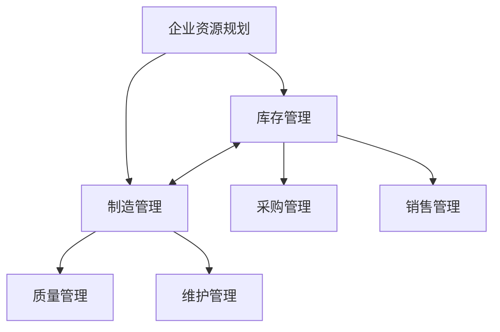

## 库存模块(Inventory)

### 库存核心概念

库存模块（stock）是 Odoo 中管理物料流动的核心模块，它处理产品的接收、存储、移动和发送。

主要概念包括：

1. **仓库(Warehouse)**: 物理存储位置的顶级组织单位
2. **位置(Location)**: 仓库内部的具体存储区域
3. **调拨(Transfer)**: 物料从一个位置移动到另一个位置的操作
4. **库存移动(Stock Move)**: 调拨的基本单位，表示单个产品的移动
5. **操作类型(Operation Type)**: 预定义的库存操作，如收货、发货等
6. **库存盘点(Inventory Adjustment)**: 调整系统库存与实际库存的差异
7. **批次/序列号(Lot/Serial Number)**: 用于追踪特定产品批次或单个产品

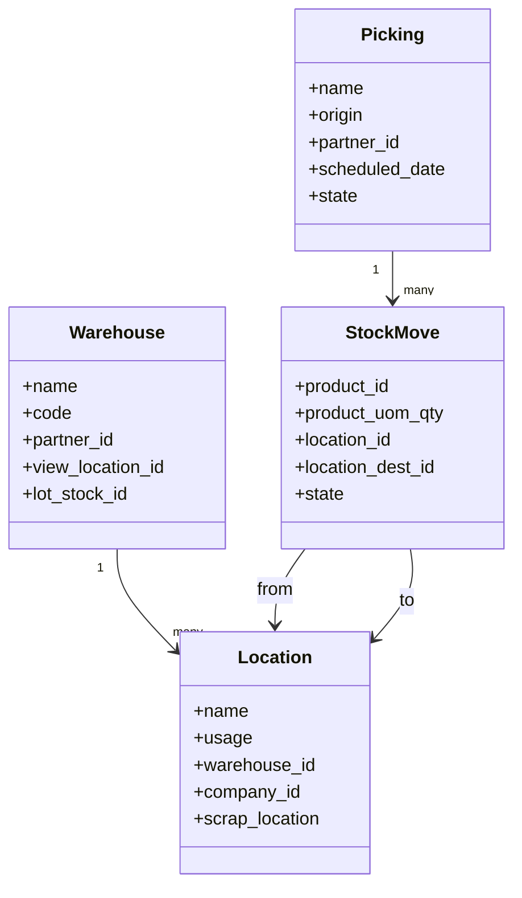

### 库存主要功能

1. **库存控制**
   - 库存水平监控
   - 多仓库管理
   - 先进先出(FIFO)、后进先出(LIFO)和平均成本计算

2. **仓库管理**
   - 区域和货架管理
   - 库存路径设置
   - 补货规则管理

3. **收发货管理**
   - 供应商收货
   - 客户发货
   - 内部调拨

4. **库存盘点**
   - 定期盘点
   - 循环盘点
   - 差异分析

5. **批次管理**
   - 批次跟踪
   - 序列号管理
   - 保质期控制

6. **条码管理**
   - 产品条码扫描
   - 移动设备支持
   - 批量处理

### 库存工作流程

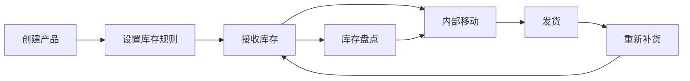

以下是一个典型的库存操作流程:

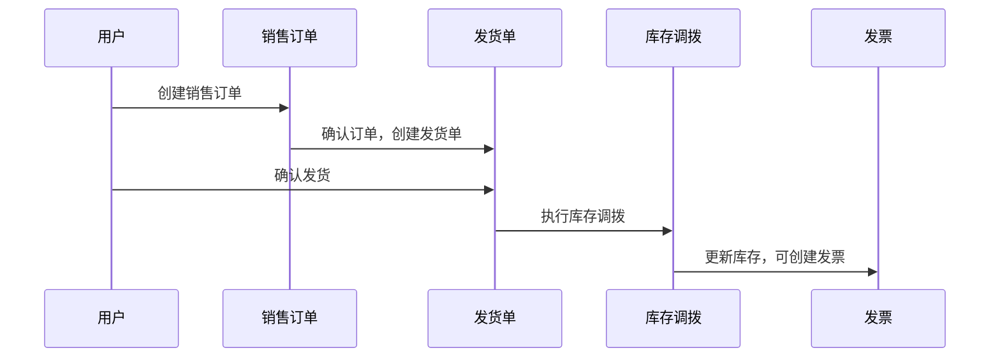

### 库存配置指南

1. **基础设置**
   - 导航到 Inventory > Configuration > Settings
   - 启用所需功能（批次追踪、多仓库等）
   - 设置计量单位

2. **仓库配置**
   - 创建仓库结构
   - 设置库存位置层级
   - 定义操作类型（收货、发货等）

3. **产品库存设置**
   - 设置产品的库存属性
   - 配置补货规则
   - 设置安全库存水平

4. **高级功能配置**
   - 路径规则设置
   - 推式和拉式规则配置
   - 批次追踪设置

## 制造模块(Manufacturing)

### 制造核心概念

制造模块(mrp)负责管理产品的生产过程，将原材料转换为成品。

主要概念包括：

1. **物料清单(Bill of Materials, BOM)**: 定义生产产品所需的组件
2. **工作中心(Work Center)**: 生产活动发生的物理位置或机器
3. **工艺路线(Routing)**: 定义生产过程中的操作顺序
4. **制造订单(Manufacturing Order)**: 生产特定产品的指令
5. **工作订单(Work Order)**: 制造订单中的单个操作步骤
6. **能力规划**: 管理生产资源的使用和调度

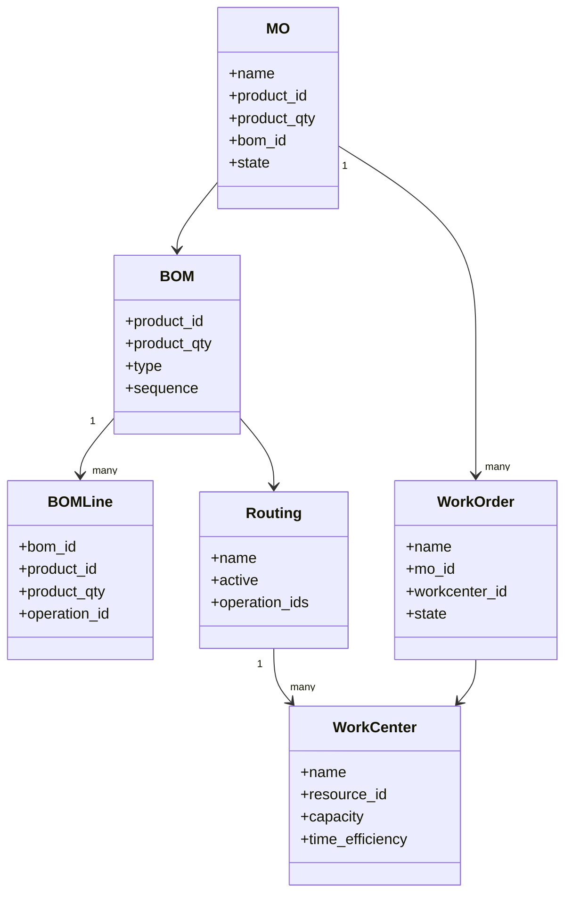

### 制造主要功能

1. **物料清单管理**
   - 多级BOM
   - 版本控制
   - 工程变更控制

2. **制造订单管理**
   - 生产计划
   - 物料需求
   - 进度跟踪

3. **工作中心管理**
   - 能力规划
   - 工作负荷分析
   - 维护计划

4. **工作订单管理**
   - 详细操作指导
   - 时间跟踪
   - 质量控制点

5. **成本管理**
   - 计划成本
   - 实际成本
   - 差异分析

6. **主生产计划(MPS)**
   - 需求预测
   - 产能平衡
   - 生产计划优化

### 制造工作流程

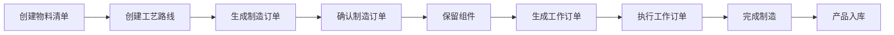

以下是一个典型的制造订单处理流程:

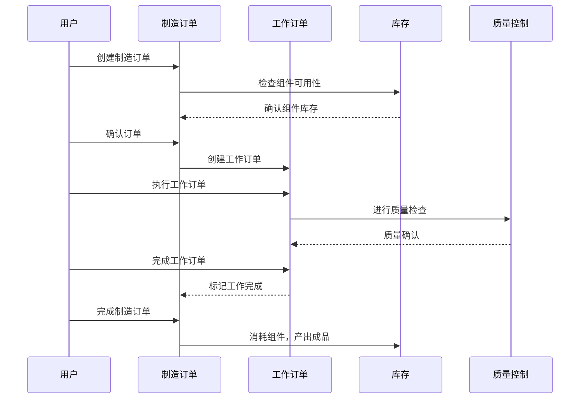

### 制造配置指南

1. **基础设置**
   - 导航到 Manufacturing > Configuration > Settings
   - 启用所需功能（工作订单、质量控制等）
   - 设置默认库存消耗方法

2. **物料清单设置**
   - 创建产品结构
   - 设置组件关系
   - 配置替代品和副产品

3. **工作中心设置**
   - 创建工作中心
   - 设置工作时间和能力
   - 配置成本结构

4. **工艺路线设置**
   - 创建操作步骤
   - 分配工作中心
   - 设置操作时间

## 模块交互

### 库存与制造的集成点

制造模块与库存模块紧密集成，主要交互点包括：

1. **材料消耗**: 制造订单从库存中消耗原材料
2. **成品入库**: 生产完成后将成品加入库存
3. **库存可用性检查**: 确保有足够的原材料可用于生产
4. **副产品和废料处理**: 管理生产过程中的副产品和废料

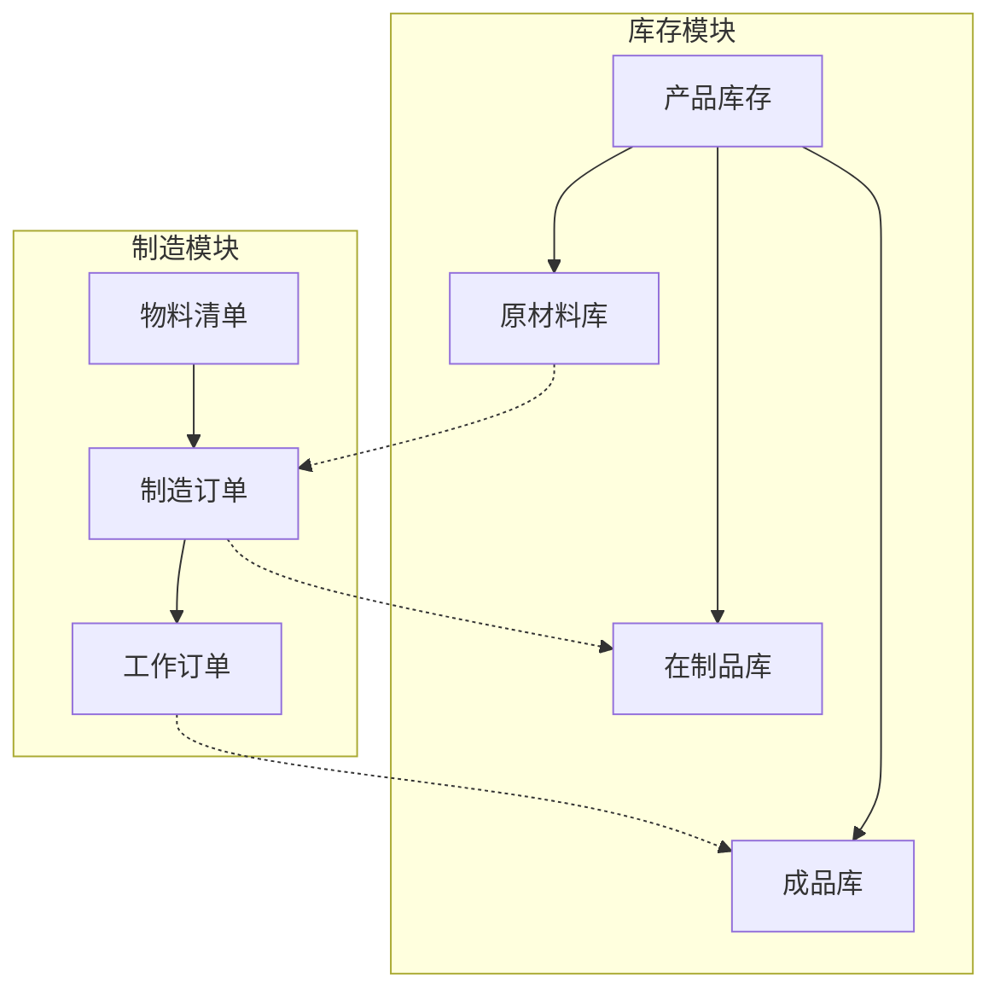

### 数据流向

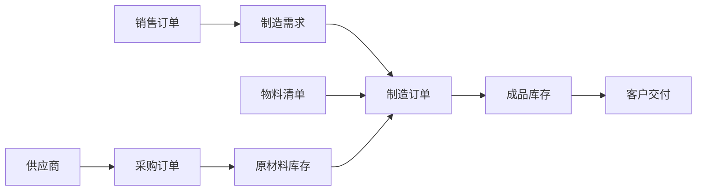

## 常见业务场景

### 场景一：按订单生产(Make-to-Order)

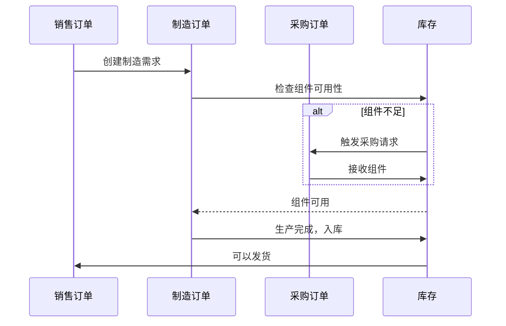

### 场景二：库存补货(Make-to-Stock)

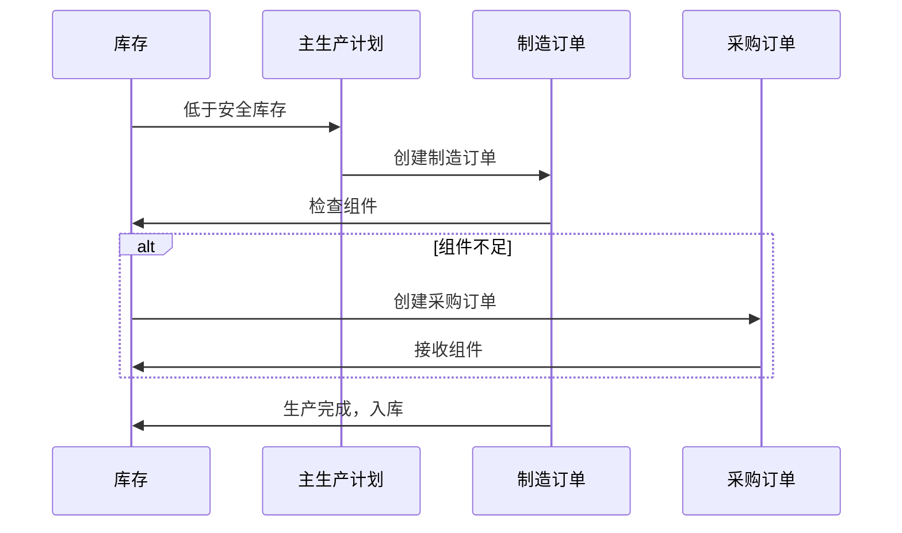

### 场景三：混合生产(多级BOM)

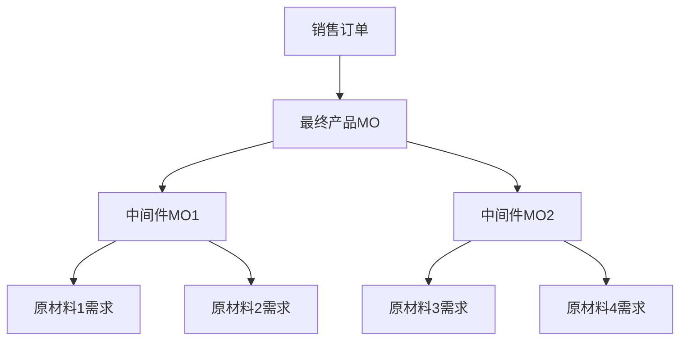

## 自定义和扩展

### 常见自定义需求

1. **自定义工作流**
   - 添加新的生产状态
   - 修改审批流程
   - 定制质量检查点

2. **报表扩展**
   - 生产效率分析
   - 物料使用差异报表
   - 成本分析报表

3. **集成扩展**
   - 与PLM(产品生命周期管理)系统集成
   - 与MES(制造执行系统)集成
   - 与设备/机器集成

### 自定义方法

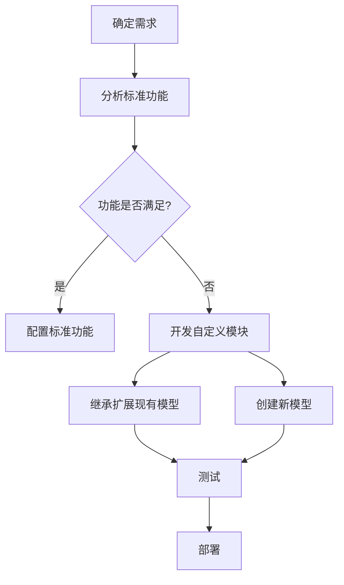

## 故障排除

### 常见问题

1. **物料不足**
   - 检查库存水平
   - 验证预留机制
   - 检查补货规则

2. **成本计算不准确**
   - 验证BOM成本设置
   - 检查工作中心成本设置
   - 审核实际生产时间记录

3. **生产延迟**
   - 检查工作中心能力
   - 验证物料可用性
   - 审核工作订单执行情况

### 解决方案

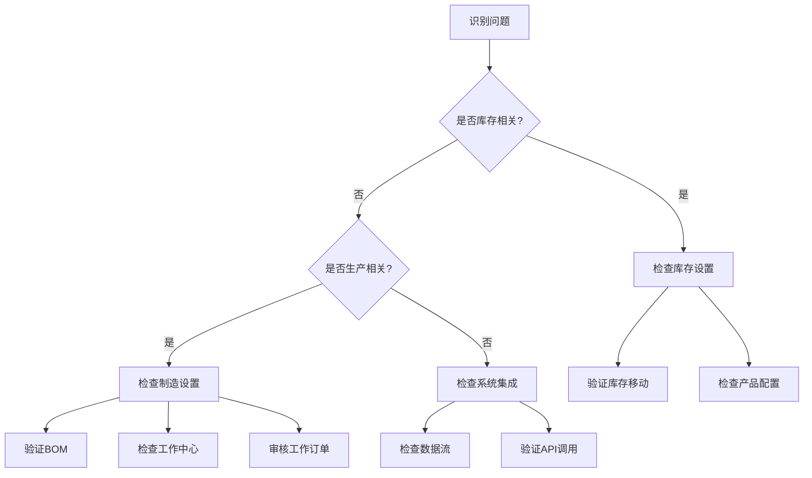

## 结论

Odoo的库存和制造模块提供了强大的功能来管理您的生产和库存需求。通过理解核心概念、流程和配置选项，您可以有效地利用这些模块来优化您的业务运营。

本指南提供了一个起点，但Odoo平台的灵活性意味着还有更多可探索的功能和可能性。建议在实施过程中结合您的具体业务需求进行适当的配置和定制。 